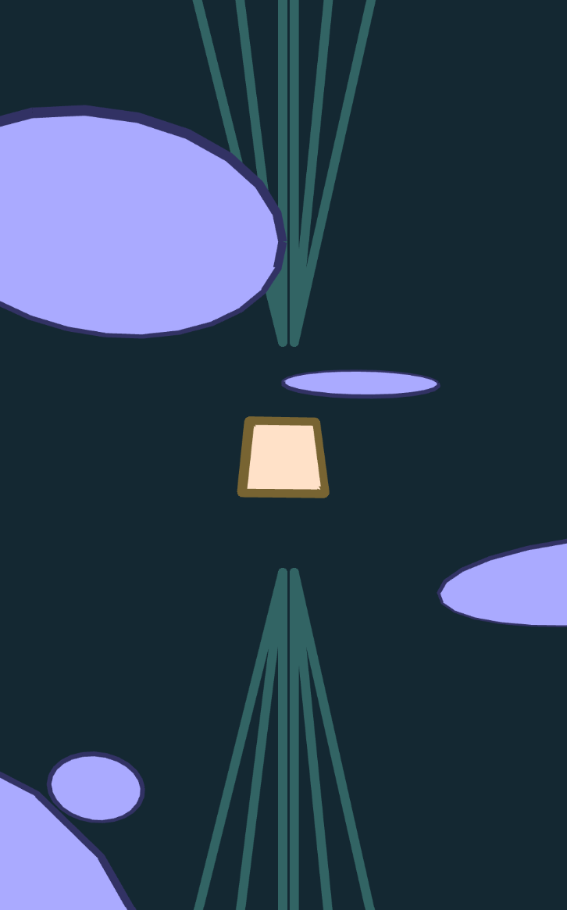

# cart253

## Course repository for CART253 (Autumn 2026)

## :star: Welcome to ==Justine's== course repository! :star:

This website serves to present the prototyping work I will create in my class CART253, at Concordia University! I will be developing my coding skills using Javascript, making prototypes, and adding them here gradually, throughout the autumn semester.

### Useful links :link::bangbang::bookmark:

- [My reflective journal](journal.md)

### Prototypes :space_invader: :space_invader:

#### Instructions 3 Prototypes

##### The Last Little Pig - Midnight Snack

[View online](https://justjust11-bit.github.io/cart253/topics/instructions/INSTRUCTIONS-PROTOYPES-HERE/midnight-snack/) -
[View code](https://github.com/justjust11-bit/cart253/tree/main/topics/instructions/INSTRUCTIONS-PROTOYPES-HERE/midnight-snack)

##### Abstract Prototype

[View online](https://justjust11-bit.github.io/cart253/topics/instructions/INSTRUCTIONS-PROTOYPES-HERE/movements/) -
[View code](https://github.com/justjust11-bit/cart253/tree/main/topics/instructions/INSTRUCTIONS-PROTOYPES-HERE/movements)

##### Strange Man

[View online](https://justjust11-bit.github.io/cart253/topics/instructions/INSTRUCTIONS-PROTOYPES-HERE/strange-man/) -
[View code](https://github.com/justjust11-bit/cart253/tree/main/topics/instructions/INSTRUCTIONS-PROTOYPES-HERE/strange-man)
