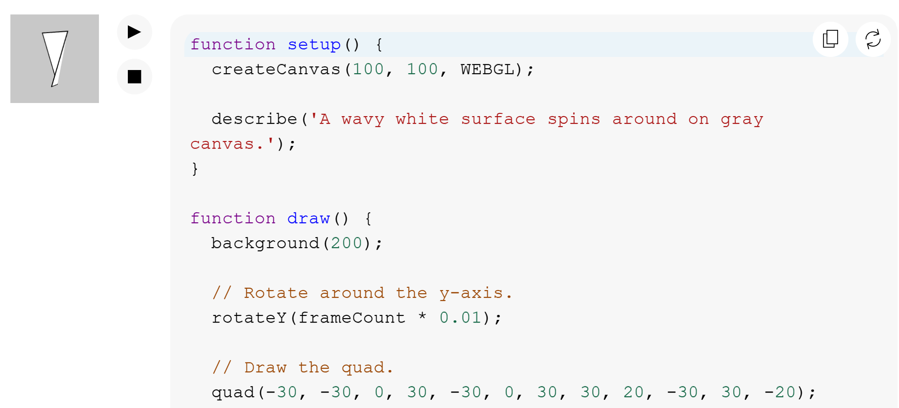

# Reflective journal :ledger::thought_balloon:

## Entry 1: September 9th 2026

This is my _first_ journal entry for my ==CART253== class. I used Github to host my website page for the class, and created this journal page you are currently reading. I used Markdown to format the pages. Initially when I read that we were going to use Markdown, I thought it would be an app or a mod, and I was surprised to see that it was the markers used on different websites such as Reddit. I'm familiar with the ones used on Youtube, and formerly Hangouts, and Google+, so it was not too difficult for me understand the concept.

I started editing the README.md on the Github web page initially, then realized I was better off using VScode instead. I hadn't read all of the instructions before I started so I didn't know about the Markdown open preview, so I did many _(~~way too many~~)_ commits, trying to fix a problem I had with uploading an image. I'm looking forward to being able to apply Markdown more smoothly and to make small works of art using code. My aspiration when making art is to be able to make something that surprises people, that makes them think, or that makes them feel any sort of emotion. If the viewer feels something when looking at my art, I feel proud of my work. I also like being able to surpass my own expectations. I feel satisfied when I do something that I have never done before, and use tools in different ways.

**Edit, September 14th**: I wanted to make this website more visually entertaining so I added relevant emojis, a colourful banner, some text in _italics_, **in bold**, and a bullet point for my useful links. I had some trouble with the sizing of the photos, and the emojis so I asked for help in the Discord server, and that helped me speed up my process. Below, I added a screenshot of the main page of this site, that I finished today! I used Aseprite to make a pixel art banner, and vines. :last_quarter_moon_with_face: :star2:

- [x] **Amazing work Justine I'm very impressed! Have 100$**
- [ ] **What**
- [ ] **Hello**

## Entry 2: September 22nd 2026

I finished my three "Instructions Prototypes" today. For my three prototypes I tried doing different styles and using different tools from the p5 library in each one of them. The first prototype I made was the Three Little Pigs inspired piece. For this prototype, I played around with the opacity (using alpha), for the moon, and the lighting inside of the house with the pig. I tried to use triangles as well to challenge myself, which -in retrospect, might have not been the best idea for time management, but I'm rather satisfied with the end result. I also used a rounded rectangle that was same colour as the background to cut the wolf a more interesting shape. The second prototype I made was the abstract prototype, which I played around more with the 3D possibilities on javascript, using WEBGL. I used the sample of the code that was used for a quad and modified it so the circles would also have the propreties that make it move, but look different. I like the way the 3D looks, and I think it might be my most eye-catching prototype. For my last piece, I used the code that uses pi from p5 to make an arc for the mouth of the man.

Doing these prototypes took me longer than I expected. I was busy this weekend, and I wish I could've had more time to think about what I wanted to do. My approach for all of these was to have a vague idea of what I want and to just start adding stuff to see what sticks. I have a habit of doing things this way, but I think for next time, it would be fun to change my technique and maybe first draw out what I would like to do first, and once I like the drawing I did, I could try recreating it.
