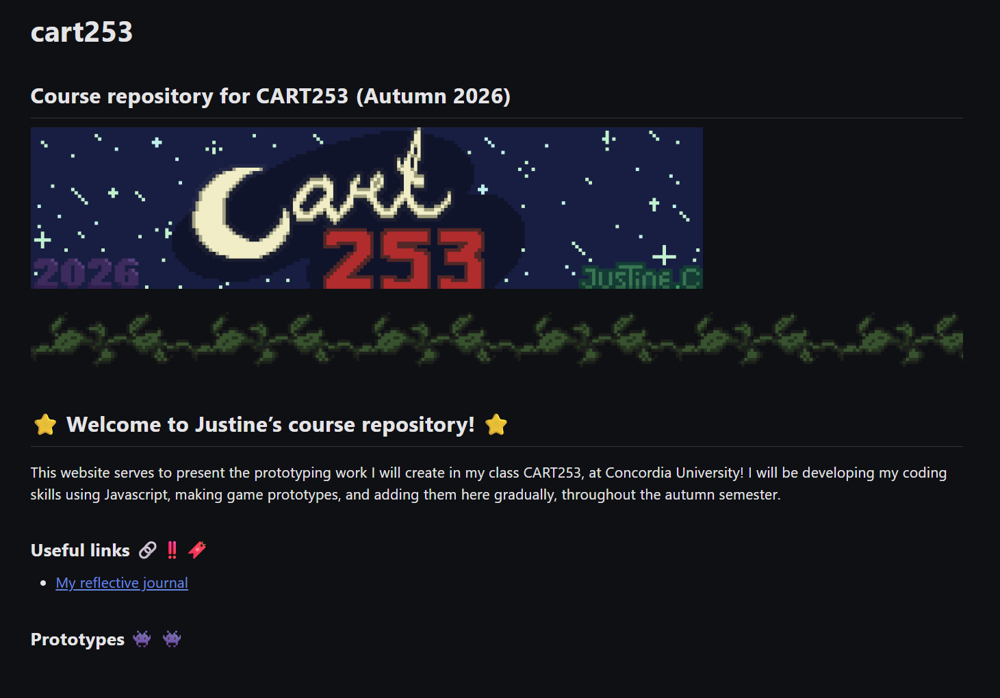
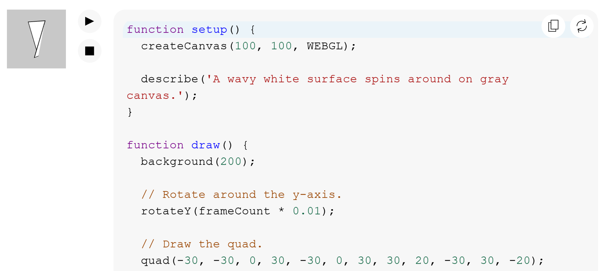
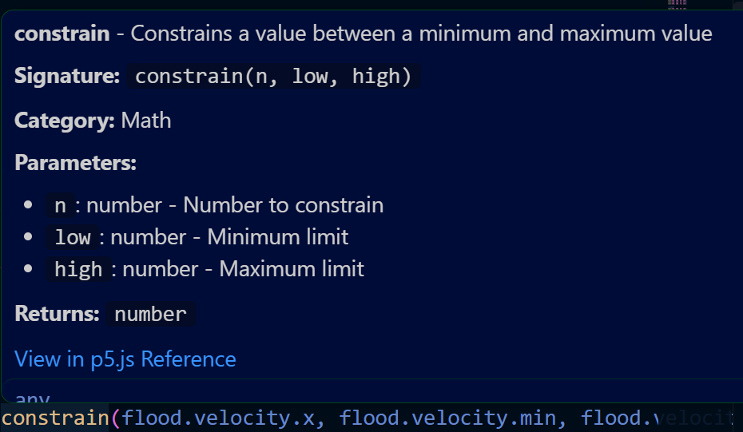
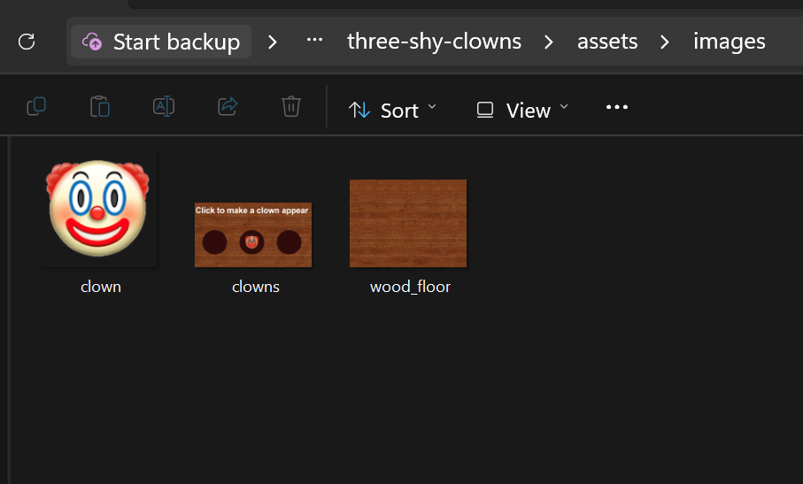

# Reflective journal :ledger::thought_balloon:

## Entry 1: September 9th 2026

This is my _first_ journal entry for my ==CART253== class. I used Github to host my website page for the class, and created this journal page you are currently reading. I used Markdown to format the pages. Initially when I read that we were going to use Markdown, I thought it would be an app or a mod, and I was surprised to see that it was the markers used on different websites such as Reddit. I'm familiar with the ones used on Youtube, and formerly Hangouts, and Google+, so it was not too difficult for me understand the concept.

I started editing the README.md on the Github web page initially, then realized I was better off using VScode instead. I hadn't read all of the instructions before I started so I didn't know about the Markdown open preview, so I did many _(~~way too many~~)_ commits, trying to fix a problem I had with uploading an image. I'm looking forward to being able to apply Markdown more smoothly and to make small works of art using code. My aspiration when making art is to be able to make something that surprises people, that makes them think, or that makes them feel any sort of emotion. If the viewer feels something when looking at my art, I feel proud of my work. I also like being able to surpass my own expectations. I feel satisfied when I do something that I have never done before, and use tools in different ways.

**Edit, September 14th**: I wanted to make this website more visually entertaining so I added relevant emojis, a colourful banner, some text in _italics_, **in bold**, and a bullet point for my useful links. I had some trouble with the sizing of the photos, and the emojis so I asked for help in the Discord server, and that helped me speed up my process. Below, I added a screenshot of the main page of this site, that I finished today! I used Aseprite to make a pixel art banner, and vines. :last_quarter_moon_with_face: :star2:

- [x] **Amazing work Justine I'm very impressed! Have 100$**
- [ ] **What**
- [ ] **Hello**

## Entry 2: September 22nd 2026

I finished my three "Instructions Prototypes" today. For my three prototypes I tried doing different styles and using different tools from the p5 library in each one of them. The first prototype I made was the Three Little Pigs inspired piece. For this prototype, I played around with the opacity (using alpha), for the moon, and the lighting inside of the house with the pig. I tried to use triangles as well to challenge myself, which -in retrospect, might have not been the best idea for time management, but I'm rather satisfied with the end result. I also used a rounded rectangle that was same colour as the background to cut the wolf a more interesting shape. The second prototype I made was the abstract prototype, which I played around more with the 3D possibilities on javascript, using WEBGL. I used the sample of the code that was used for a quad and modified it so the circles would also have the propreties that make it move, but look different. I like the way the 3D looks, and I think it might be my most eye-catching prototype. For my last piece, I used the code that uses pi from p5 to make an arc for the mouth of the man.

Doing these prototypes took me longer than I expected. I was busy this weekend, and I wish I could've had more time to think about what I wanted to do. My approach for all of these was to have a vague idea of what I want and to just start adding stuff to see what sticks. I have a habit of doing things this way, but I think for next time, it would be fun to change my technique and maybe first draw out what I would like to do first, and once I like the drawing I did, I could try recreating it.

## Entry 3: September 29th 2026

For my three Variables Protoypes, I wanted there to be a unique mechanic for each one of them that incorporate variables. BAD IDEA uses lerpcolor, and the mouseX and mouseY stuck to one corner. Symmetrical Scratch Art uses pmouse for the drawing, and I made the colours of the drawing lines use the coordinates of the canvas to choose the colours used, and I used relative positioning(? I think is what its called, the dividing by two to get to the center of the canvas) to help keep the brushes starting in the middle.I also removed every number in the code, after the "let"s. Flooding City!, is the last prototype I made. I added velocity, an acceleration, and a constraint for the flood's highest point.

I think I'm starting to get more used to coding, and using javascript... I'm starting to remember the syntax more, which isn't something that comes very naturally to me. The more I use different mechanics, and am able to make small things at a faster speed, the more I feel like the cloud of confusion is slightly being lifted.

I've been hovering over the p5 words that have a preset meaning(value?) to help myself understand more clearly how to format things more quickly, instead of just tinkering with every number or value to figure out what it does, which is what I would do for the previous prototypes. I'm sure I could come up with interesting ideas just by messing around, but it really speeds up the process if I already have an idea decided and I'm only focusing on executing.

## Entry 4: October 7th 2026

I finished my Conditionals prototypes today. I think what I found to be the most difficult for these prototypes was coming up with an idea that I liked that was scaled down. There are so many possibilities that become possible once you add conditionals, but at the level I am currently at, it is difficult to expand much more without having to look up references and asking for help. I have to also spend a lot of time thinking about the placement of certain things, look up how to do the syntax for certain things because I keep forgetting how to do them. I also tried leaving comments a lot more to help myself when I look back on my code.

I like my first two prototypes, and Ocean Domination in particular, I would've liked to work on it more; make the fish start out small and get bigger. I also like the randomness and the fortunes you can get in my Fortune Cookie prototype. Initially for my last prototype, Three Shy Clowns, I wanted to make a whack-a-mole where you could get +1 point for each weasel you smack. I thought it wouldn't be too difficult, but when I started making it, I realized it would be a lot more complicated and take more time than I initially envisonned. Doing these prototypes is helping me understand the scope of making different types of small games (or playful programming prototypes), and how long or how difficult a project can be. I think the most annoying thing I ran into was having to write the same code but changed slightly (by numbering them) for example with the wrappers, or the fish (mene), or the holes. I think it wasn't the most effective way to do write my code, but it was the only way I could think of. Also, I only now realized that I should've been putting my images for prototypes in the /assets/images path, since I had been making my own folder called 'images' in the same section as where 'assets' is.

